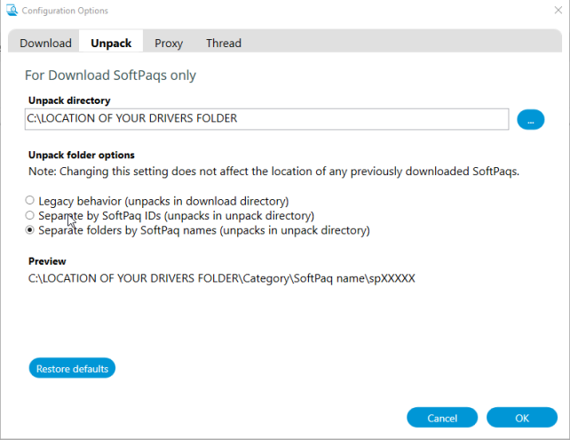

# Windows Deployment Tools
These tools are to be used to capture and modify a Windows Image for deployment to various computers.
There are 2 main tools in the repository.
- ImageModification - This can be used to inject device drivers and languages into an image.
- WinPE - This is used to create a WinPE drive that can be used to capture or deploy an image to a computer. Because this uses a standard WinPE environment with some startup scripts to give the options to deploy or capture an image.

# Documentation 
### Last Updated July 2022

## Disclaimer
I an not sponsored, endorsed or affiliated with Microsoft and these tools were created for my own use. <br>
These tools may change at any time and features could be removed or added at random (I will try to document any changes but this isn't a promise). These scripts are to be used at your own risk. <br>
Please note that any other companies mentioned in the documentation are only used as examples to properly show how the scrips should be used. I am not endorsed, sponsored or affiliated with any of these companies. These are just random examples that have been selected to give a variety in the documentation. <br>
If any companies would like me to remove anything mentioned here in the documentation please contact me through my website: https://joshuaglass.dev/#contact or create an issue/pull request.

## Contributions
Conributions are welcome from anyone to help improve the documentation or the project. <br>
Just create a pull request with the changes and state what changes you have made any why. <br>
Alternatively, you can create an issue and I will consider any changes that are requested.

## License
This project is licensed under the MIT License which can be seen below or in the LICENSE file.
```
The MIT License (MIT)

Copyright (c) 2022 Joshua Glass (SuperNinja_4965)

Permission is hereby granted, free of charge, to any person obtaining a copy
of this software and associated documentation files (the "Software"), to deal
in the Software without restriction, including without limitation the rights
to use, copy, modify, merge, publish, distribute, sublicense, and/or sell
copies of the Software, and to permit persons to whom the Software is
furnished to do so, subject to the following conditions:

The above copyright notice and this permission notice shall be included in
all copies or substantial portions of the Software.

THE SOFTWARE IS PROVIDED "AS IS", WITHOUT WARRANTY OF ANY KIND, EXPRESS OR
IMPLIED, INCLUDING BUT NOT LIMITED TO THE WARRANTIES OF MERCHANTABILITY,
FITNESS FOR A PARTICULAR PURPOSE AND NONINFRINGEMENT. IN NO EVENT SHALL THE
AUTHORS OR COPYRIGHT HOLDERS BE LIABLE FOR ANY CLAIM, DAMAGES OR OTHER
LIABILITY, WHETHER IN AN ACTION OF CONTRACT, TORT OR OTHERWISE, ARISING FROM,
OUT OF OR IN CONNECTION WITH THE SOFTWARE OR THE USE OR OTHER DEALINGS IN
THE SOFTWARE.
```

# Building a WinPE USB Drive to use for PC Imaging and Image Capturing

## Requirements
In order to use the tools in this script you will need to install the Windows ADK and the WinPE addon. To install them:

1. The windows ADK can be downloaded here: https://docs.microsoft.com/en-us/windows-hardware/get-started/adk-install
2. You will need to download and install the "[Windows ADK](https://go.microsoft.com/fwlink/?linkid=2196127)" and the "[WinPE add-on for the Windows ADK](https://go.microsoft.com/fwlink/?linkid=2196224)" 
    - *Note: <br>
    When installing the Windows ADK it is recommended you select all of the install options when asked which components you would like to install. 
    <br>
    It is also important to take into consideration which ADK version you need (especially when working with multiple versions of windows). For best practice and results you should use the ADK version that is for the version of windows you plan to be deploying.
    <br>
    Read more at: https://docs.microsoft.com/en-us/windows-hardware/get-started/adk-install#considerations-when-youre-working-with-more-than-one-windows-version*

## Automatically using MakeWinPEDrive.bat

Building a new USB to use to image a PC is simple when using the Windows Deployment Tools
Before proceeding, please make sure you have installed the Windows AKD and WinPE addon.

1. Connect the USB drive that is going to be setup for Imaging PC's
2. Navigate to the WinPE Folder in the Windows Deployment Tools and run the MakeWinPEDrive.bat.
3. Answer the questions the script asks. If this is your first time running the script you may be asked if you want to create and modify WinPE - Say yes.
4. After answering the options and selecting the drive you would like to use, the script will create a WinPE Drive that can be used for Imaging a PC.
   - *Note: This script WILL FORMAT the selected drive. Please make sure any data is backed up before using the script.*
6. Once the drive has been created you could notice 2 new partitions mounted as P: and O:
   - *Note: Ensure that nothing else is mounted as P or O before starting otherwise files may be copied to these devices. For the same reason only setup one drive at a time and disconnect the old drive before connecting a new one to setup. Otherwise the new drive will not be mounted and have the winpe files copied to it.*
7. Copy the wim file you would like to use onto the O: partition. The name of the file is unimportant.

### Errors
If an error occurs while running this script you may need to check to see if the WinPE Image was unmounted or not by checking to see if the `mount` folder is empty or not (located in the WinPE_amd64 folder that was created. If there is no folder then you are all good). If it wasn't see the unmount an image instructions in the building an image manually instructions (use the discard command).

## Manually

Creating a WinPE Drive manually may be useful to understand how the script works when it creates WinPE media for you.
Before proceeding, please make sure you have installed the Windows AKD and WinPE addon.

### 1. Open the Deployment and Imaging Tools as Administrator
First, we will need to prepare a Windows PE Environment to be used:

### 2. Copy the WinPE to our C Drive:
```bat
copype amd64 .\WinPE_amd
```

### 3. Mount the WinPE Image:
```bat
Dism /Mount-Image /ImageFile:".\WinPE_amd64\media\sources\boot.wim" /Index:1 /MountDir:".\WinPE_amd64\mount"
```
### 4. We will need to modify the startup script so winpe automatically runs our scripts:
The file is located at: `C:\WinPE_amd64\mount\Windows\System32\startnet.cmd`. Modify the file so it has the following inside it:
```bat
wpeinit
powercfg /s 8c5e7fda-e8bf-4a96-9a85-a6e23a8c635c
@ echo *********************************************************************
@ echo -- Working out 'USB-B' drive letter --
@ IF EXIST D:\Scripts SET USBB = D:
@ IF EXIST E:\Scripts SET USBB = E:
@ IF EXIST F:\Scripts SET USBB = F:
@ IF EXIST G:\Scripts SET USBB = G:
@ IF EXIST H:\Scripts SET USBB = H:
@ IF EXIST I:\Scripts SET USBB = I:
@ echo The 'USB-B' drive is %USBB%
@ echo *********************************************************************
%USBB%
@ cd Scripts
@ call Entrypoint.bat
:end
```

### 5. Next, we need to unmount and save the image:
```bat
Dism /Unmount-Image /MountDir:.\WinPE_amd64\mount /Commit
```

### 6. We now need to format and create the hard drive partitions for our USB
In the command prompt type the command `diskpart` to open diskpart. <br>
Inside diskpart you will need to run these commands (you can ignore the rem commands they are just comments):
```bat
list disk
select disk ENTER-YOUR-DISK-NUMBER-HERE-FROM-PREVIOUS-OUTPUT
Automount disable
Automount Scrub
clean
rem === Create the Windows PE partition. ===
create partition primary size=500
format quick fs=fat32 label="WinPE"
assign letter=P
active
rem === Create a data partition. ===
create partition primary
format fs=ntfs quick label="USB-01"
assign letter=O
list vol
Automount enable
Exit
```
These commands create 2 partitions on the drive, one for Windows PE and another for your Wim images and scripts.

### 7. Now we need to install windows PE to our P: parition:
```bat
MakeWinPEMedia /UFD /f .\WinPE_amd64 P:
```

### 8. Finally, we need to copy our scripts to the USB drive.
Make sure your scripts are in a folder called Scripts.
```bat
mkdir O:\Scripts
xCopy ".\Scripts" O:\Scripts /e /q
```
*Note: When the WinPE environment is loaded it will look for a script called `Entrypoint.bat` in the scripts folder. If you want anything to happen on load you will need to ensure that this batch file exists and has commands in it. The included scripts folder in this project is already setup for this. <br>
The scripts used to deploy an image onto a computer are a modified version of sample scripts written by Microsoft. Because of this at this time they will not be documented here.
Link to Microsoft's scripts and their notes: https://docs.microsoft.com/en-us/windows-hardware/manufacture/desktop/windows-deployment-sample-scripts-sxs <br>
Direct Download Link: https://go.microsoft.com/fwlink/?linkid=872894*

## Using the created WinPE Media
When booting into created WinPE media, the media will look for the scripts folder. Upon finding the scripts folder it will call a file called `Entrypoint.bat`.

When booted into the media and saying yes to allow the drive to be wiped the USB key will search the ROOT directory of the drive with the scripts folder for wim files. If only one wim file is detected it will be auto selected and the pc will be imaged. If more than one wim file is found, you will be asked which image you would like to use.

# Capturing an Image
If no images are found the tool (while booted into WinPE) will ask if you would like to capture the image on the existing system. You can also get to the capture menu by saying NO to the "would you like to proceed imaging?" message. 

It is important to note that you cannot just capture any windows installation to be used to image multiple computers. The install must be Syspreped and Generalised. At this time this documentation will not document how to do this.

If you would like to capture an image manually this can be done by using the following DISM command while booted into a WinPE environment: 
```bat
dism /capture-image /imagefile:"D:\Image.wim" /capturedir:C:\ /name:"Windows 10" /Description:"Windows 10" /compress:maximum /checkintegrity /verify /ScratchDir:"D:\ScratchDir" /LogPath:"D:\Log.log"
```
Command parameters:
```
/imagefile: Where the image is saved and what it is called. 
/capturedir: Where the source windows install is. 
/ScratchDir: This is needed to prevent errors. 
/LogPath: Where the DISM log is stored. 
```

# Building a Windows Image
This section assumes that you have already captured a base image from a computer. This section covers modifying that image and installing drivers and languages to it. For capturing an image see above.

It is important to note that you cannot just use any windows image to be used to image multiple computers. The image must be Syspreped and Generalised. At this time this documentation will not document how to do this.

## Requirements
In order to use the tools in this script you will need to install the Windows ADK and the WinPE addon. To install them:

1. The windows ADK can be downloaded here: https://docs.microsoft.com/en-us/windows-hardware/get-started/adk-install
2. You will need to download and install the "[Windows ADK](https://go.microsoft.com/fwlink/?linkid=2196127)" and the "[WinPE add-on for the Windows ADK](https://go.microsoft.com/fwlink/?linkid=2196224)" 
    - *Note: <br>
    When installing the Windows ADK it is recommended you select all of the install options when asked which components you would like to install. 
    <br>
    It is also important to take into consideration which ADK version you need (especially when working with multiple versions of windows). For best practice and results you should use the ADK version that is for the version of windows you plan to be deploying.
    <br>
    Read more at: https://docs.microsoft.com/en-us/windows-hardware/get-started/adk-install#considerations-when-youre-working-with-more-than-one-windows-version*

## Other tools and resources needed.
To create images that are to be used to image pc's you are going to need a few tools and resources that are not included with the Windows Deployment Tools.

### Drivers
If you intend to install drivers to the image you will need a Drivers folder in the same location as the BuildImage.bat script (this is assuming you are using the script to build the image).

Inside the drivers folder it is recommended that you have a folder for each set of drivers you are including. Each folder inside the Drivers folder is a driver set.

The script will ask you whether you would like to install all the available sets of drivers or if you would like to install a specific set of drivers (you can only select ALL sets or ONE set).

Example folder structure for the drivers folder:
- Drivers
  - EXAMPLE: HP
    - EXAMPLE: Network Drivers
  - EXAMPLE: DELL
    - EXAMPLE: Network Drivers
  - EXAMPLE: Lenovo
    - EXAMPLE: Network Drivers

This example has 3 driver sets that would appear in the menu: HP, DELL and Lenovo. 

The script expects that any drivers inside the drivers folder are downloaded and EXTRACTED from their installer package. Only drivers that support INF installation will be installed when using this tool.

### Example: Downloading and extracting HP drivers.
HP provides a handy tool called the HP Image assistant that you can use to both download and extract the drivers for a list of computers.

The tool can be downloaded from HP's website here: http://ftp.ext.hp.com/pub/caps-softpaq/cmit/HPIA.html

To download and extract drivers select the download icon from the left: 

Before downloading the drivers it is recommended that you change the default
download paths to the location of the Drivers folder you would like to have the drivers in.

To change the defualt path go to Tools --> Configuration options, then navigate to the unpack tab and change the location to the place where you would like to have the drivers (this will need to be in the Drivers folder inside a folder of your choosing).

You need to change the unpack option to: “Separate folders by SoftPaq Names" as this will make the software unpack the drivers into a different location (the folder we selected).

See below for an example: <br>


To start the download and extraction process in the "Download SoftPaqs" menu click "create list" and search and select the different models of computers you would like to download drives for. Make sure you select the drivers for the latest version of windows that is available for the computer in the example here the latest available is for windows 10 1809. But do not download Windows 11 drivers if you are using a windows 10 image as these are likely to not be compatiable.

See below for an example: <br>


Once you have selected the computers you would like to download drivers for click "Apply" and then click on the analyze button to allow the software to get a list of the latest drivers available for those computers.

Once the software had loaded in the dropdown click download all drivers and then click the download button. <br>
*Note: The tools that i use within the scripts to install drivers into an image will only install INF drivers and therefor it might also be best to select the INF Installation Supported option to prevent drivers that cannot be installed using the scripts to be downloaded needlessly. Any drivers that do not support INF installation might be best installed before the image is created.*

See below for an example: <br>


When you are ready to download click the downlaod buttoon and wait. If asked about which operation you would like to do select the "Download anbd extract SoftPaqs" option and then press start.

See below for an example: <br>


This process may take a while as it is downloading the drivers and extracting them
for use. This will most likely use ALOT of disk space.

Once this process is finished, assuming all went ok, the HP drivers should be setup.


### Example: Downloading and extracting Dell Drivers 
To download dell drivers, you need to download the family driver pack for that device family. You will need to do this for each family of device that you are imaging.
Downloads can be found here: https://www.dell.com/support/kbdoc/000180534/dell-family-driver-packs

Once you have downloaded the file containing the family driver packs you will need to extract the drivers into the drivers folder. To do this in most cases run the exe file downloaded and you will be asked where to extract the drivers. Select your folder and you should be ready to use them.

Dell does provide a tool similar to HP's Image Assistant but to download this you will need to create an account etc. 

### Example: Downloading and extracting Lenovo Drivers
Navigate to this URL: https://support.lenovo.com/gb/en/solutions/sccm-index#tp

For each model of PC download the driver pack for Windows 10/11 depending on you images Windows version. Each driver pack will provide you with an exe that you will have to run. When you run the exe it will ask for an extraction point, to save time select the folder for your Lenovo drivers in the drivers folder and they will be extracted there.

### Languages
The languages folder (which should be located in the same place as the BuildImage.bat script) has a very specific naming scheme.

Inside the language folder there should be a folder for each language. The naming of this folder is CRITICAL.

The folder should be named the language code of the language you are installing for example: de-de for German.

Each folder requires 3 files to install the language to the image:
- LanguageExperiencePack.***de-de***.Neutral.appx
- License.xml
- Microsoft-Windows-Client-Language-Pack_x64_***de-de***.cab

If you look at the highlighted part of the files this is why the folder must be named a specific way (i.e. de-de) this is because the files that are used to install the languages include this country code in their filename. The script will look at the folder name to know what the language install files are called.

### Downloading the language files.
To add languages to an image you will need to download the LANGUAGE ISO from this page:
https://docs.microsoft.com/en-us/azure/virtual-desktop/language-packs. You are going to want to select the language ISO for the version of windows you are using

*As of July 2022, Windows 10 21H2 is the latest version of Windows 10 and this link is the download for the language ISO you are going to need: https://software-download.microsoft.com/download/pr/19041.1.191206-1406.vb_release_CLIENTLANGPACKDVD_OEM_MULTI.iso*

Once the file has downloaded you will need to get the files you are going to need from the file. Open the file by double clicking on it.

Once you have opened the file navigate to the `LocalExperiencePack` folder, copy the folders for the languages you are going to need to the `Languages` folder (located with the `BuildImage.bat` script). As the folders are already named correctly you
shouldn't need to do anything with them. Inside the folders you copied there should be 2 of the 3 files we need to install the language.

To get the 3rd file leave the `LocalExperiencePack` Folder and go into the x64 folder and enter the `langpacks` folder inside that. Inside that folder you will need to get the file for each language you have copied to your `Languages` folder. This file in this folder will need to be copied into the folder with the other 2 files for that language.

If you have done this correctly you should have the folder scheme similar to this:
- Languages
  - EXAMPLE: de-de
    - LanguageExperiencePack.de-DE.Neutral.appx
    - License.xml
    - Microsoft-Windows-Client-Language-Pack_x64_de-de.cab
  - EXAMPLE: es-es
    - LanguageExperiencePack.es-ES.Neutral.appx
    - License.xml
    - Microsoft-Windows-Client-Language-Pack_x64_es-ES.cab

### Complete Folder Schema for Building an Image
The words example here are to show that a folder is not required to make the script work but is showing an example of how the folder is laid out. <br>
Running the script without any of these folders will cause the script to create them and POSSIBLY throw an error.

- Drivers
  - EXAMPLE: HP
    - EXAMPLE: Network Drivers
  - EXAMPLE: DELL
    - EXAMPLE: Network Drivers
  - EXAMPLE: Lenovo
    - EXAMPLE: Network Drivers
- Images
  - EXAMPLE: YourImage.wim
- Languages
  - EXAMPLE: de-de
    - LanguageExperiencePack.de-DE.Neutral.appx
    - License.xml
    - Microsoft-Windows-Client-Language-Pack_x64_de-de.cab
  - EXAMPLE: es-es
    - LanguageExperiencePack.es-ES.Neutral.appx
    - License.xml
    - Microsoft-Windows-Client-Language-Pack_x64_es-ES.cab
- Mountpoint


## Using the BuiltImage.bat script to build an image
Assuming that you have properly setup the above then creating an image using the script is simple.

You will need to copy the image you want to modify to the images folder. Then simply open the script and answer the questions that are asked. You will be asked what operations you would like to do and which image you would like to do them on. If you choose to install drivers, you will be asked what set of drivers you would like to install or if you would like to install them all.

The script will then modify the image by installing the drivers to the image, installing the languages to the image and then cleaning up the image (this is assuming that you selected all 3 options).

It is recommended that you always clean up the image as this will remove any unneeded and duplicate files from the windows image etc.

Once the image has been modified a new image will appear in the images folder.

*Note: The original source image will NOT be modified in any way allowing the job to be restarted in the event the image creation fails. This also means you need to ensure that you have plenty of disk space before starting the operation.*

Depending on the number of drivers and languages this process can take a long time.

### Errors
ALWAYS check the console before closing it to ensure that the image modification completed without any errors.

If you see an error from DISM after installing the drivers and the error code is 2 then this is is expected as some drivers cannot always be installed into the image. You will need to review each driver that fails one by one to determine if this is actually an issue.
This error code should not effect the rest of the operations on the image and the image should be file to use.

Any other errors are not expected, and these should be looked at before using the image.

ALWAYS test the image you create before using to image computers. Always check that a created image does not have any unknown devices in device manager once the image has been installed to the device as this likely means you forgot to include some drivers.

If an error does occur while running the script you may need to check to see if the image was unmounted or not by checking to see if the mountpoint is empty or not. If it wasn't empty see the unmount an image instructions below (use the discard command).

## Builing the image manually

The script uses a lot of automation to save time and avoids lots of copy and pasting. If you are modifying an image manually these are DISM commands, you are going to need:

*All the commands need to be run on the **Deployment and Imaging Tools Environment** which can be opened from your start menu.*

These instructions are not really a step by step because the commands you are using will likely change depending on what you are doing.

### Mount an image
```bat
Dism /Mount-Image /ImageFile:".\Images\Working\Working.wim" /Index:1 /MountDir:".\Mountpoint"
```
Command parameters:
```
/ImageFile: The path to the image you want to mount.
/MountDir: The folder you want to mount the image to.
```

### Install all Drivers inside a folder
```bat
Dism /image:".\Mountpoint" /Add-Driver /driver:".\Drivers” /recurse
```
Command parameters:
```
/Image: Path of the folder where the image is mounted.
/driver: Path of the folder that contains the drivers you would like to install.
```

### Unmount and save a mounted image
```bat
Dism /Unmount-Image /MountDir:".\Mountpoint" /Commit
```
Command parameters:
```
/MountDir: The folder you want to mount the image to.
```

### Unmount and discard changes to a mounted image
```bat
Dism /Unmount-Image /MountDir:".\Mountpoint" /Discard
```
Command parameters:
```
/MountDir: The folder you want to mount the image to.
```

### Clean up an image
1. Run this command on the mounted image:
```bat
Dism /Image:".\Mountpoint" /Cleanup-Image /StartComponentCleanup /ResetBase
```
Command parameters:
```
/Image: Path of the folder where the image is mounted.
```
2. Unmount the image and save the changes (see above).
3. Run this command to export the image cleaned up:
```bat
Dism /Export-Image /SourceImageFile:".\Images\Working\Working-ToOptimise.wim" /SourceIndex:1 /DestinationImageFile:".\Images\Working\Working-Optimised.wim"
```
Command parameters:
```
/SourceImageFile: Path to the unmounted image.
/DestinationImageFile: Path to where the cleaned image will be stored.
```
# Useful Resources
## What's new in the ADK:
https://docs.microsoft.com/en-us/windows-hardware/get-started/what-s-new-in-kits-and-tools

## Microsoft - Notes on using the ADK
https://docs.microsoft.com/en-us/windows-hardware/manufacture/desktop/oem-deployment-of-windows-10-for-desktop-editions

## Microsoft - Build WinPE drive
https://docs.microsoft.com/en-us/windows-hardware/manufacture/desktop/oem-deployment-of-windows-10-for-desktop-editions-get-tools


## Microsoft - Sample scripts for Deploying Image
https://docs.microsoft.com/en-us/windows-hardware/manufacture/desktop/windows-deployment-sample-scripts-sxs

## Microsoft - Windows ADK install
https://docs.microsoft.com/en-us/windows-hardware/get-started/adk-install
